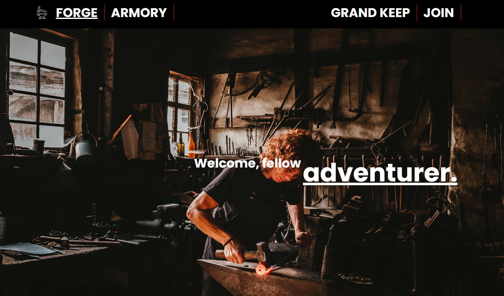
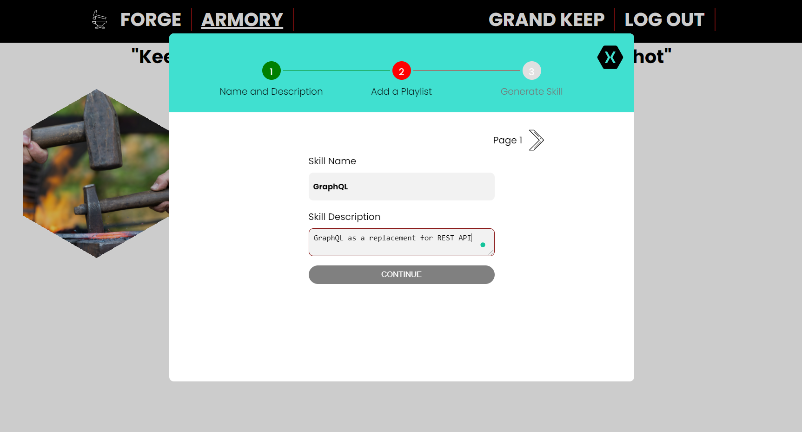

# The Forge

## Introduction
The forge is a Learning Management System that keeps users engaged by gamifying the learning experience. The site incentivize the user to keep on adding playlists (called skills) and watching it on to gain levels and achievements. It was built over the period of 3 weeks as part of the capstone project for my BrainStation web development diploma. 

The front end was built using React and some cool packages such as react-stepper, react-sliding-side-panel, and react-tabs. Moreover, I leveraged the built-in Context API and useReducer in-lieu of other React state management system such as Redux.

The back end was built using Node + Express and the API was built as a REST API and hosted on Firebase. Firebase plays a large part in powering up this application. It was used in authentication, database (Firestore), hosting (functions), and image storage. 

The live site: https://forge-education.netlify.app/

## Future plans
Right now there is no future plans to work on this website. I am proud with what I had produced over three short weeks using new libraries, new APIs, and the Firebase infrastructure. I will be working on other things

